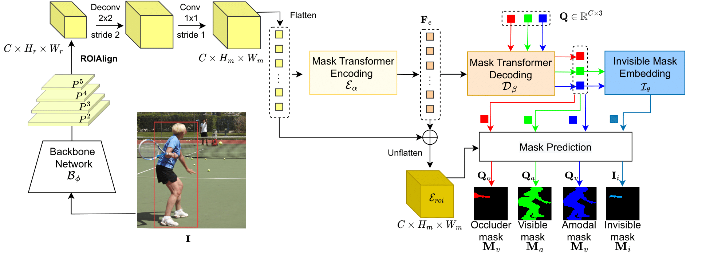

# 3D Amodal Instance Segmentation Using Sensor Fusion

The amodal instance segmentation task was defined by [Li et al](https://link.springer.com/chapter/10.1007/978-3-319-46475-6_42) (2017) as predicting both visible and occluded parts of the segmented objects. With the growing popularity of transformers for computer vision tasks, including segmentation (see [Mask2Former](https://openaccess.thecvf.com/content/CVPR2022/html/Cheng_Masked-Attention_Mask_Transformer_for_Universal_Image_Segmentation_CVPR_2022_paper.html)), a transformer-based method has emerged as the state-of-the-art method for amodal instance segmentation in 2023, namely the [AISFormer](https://arxiv.org/abs/2210.06323). 

This repository is a working exploration of adding another modality to the AISFormer approach to achieve even better results. The idea is to generate a depth mask from LiDAR data and add it as a fourth channel to the input of the amodal instance segmentation model. 

## AISFormer model
### Original
The AISFormer is a proposal based approach, meaning that it detects segmentation masks within bounding boxes given by an object detection backbone. The architecture of the AISFormer is described below (see the [original repo](https://github.com/UARK-AICV/AISFormer) for further reference).

## Re-Implementation
1) Built ResNet50 + FPN backbone for feature extraction using PyTorch components (see BackbonePP class in [aisformer_pp.py](3DAmodal/aisformer_pp.py))
2) Built AISFormer model using the [original class](https://github.com/UARK-AICV/AISFormer/blob/master/detectron2/modeling/roi_heads/aisformer/aisformer.py) from the AISFormer repo (see our code [here](3DAmodal/aisformer_pp.py))
3) Implemented training pipline including a [custom dataloader](3DAmodal/datasets/dataloader.py) and [training script](3DAmodal/train_aisformer.py).

## Detection backbone and depth mask

## 

## Datasets
In our project, we ended up using the LiDAR information of the KITTI autonmous driving dataset in combination with the amodal segmentations from the KINS dataset, because we found that this combination provides the only dataset that combines amodal segmentation annotations with 3D LiDAR data.
### [KITTI](https://www.cvlibs.net/datasets/kitti/)
- Image + LiDAR data for 3D object detection
- 7481 training images, 7518 test images + corresponding point clouds
- 80.256 labeled objects

### [KINS](https://github.com/qqlu/Amodal-Instance-Segmentation-through-KINS-Dataset)
- Based on KITTI + amodal annotations
- 14.991 human annotated images
- Benchmark for amdoal segmentation in autonomous driving scenarios

### [AmodalSynthDrive](http://amodalsynthdrive.cs.uni-freiburg.de)
The AmodalSynthDrive dataset is a synthetic dataset recorded using CARLA simulator, which includes labels for various different tasks, as well as LiDAR data. This seemed like the perfect dataset for what we were trying to achieve, however, currently (as of January 2024) the dataset is unavailable due to issues synchronization between the camera and LiDAR data.

## Training
The training of the AISFormer can run on CPU and one or mutiple GPUs. In the case of using multiple GPUs, there are two options to choose from: distributed data and distributed model, however, these options are exclusive, i.e. it is not possible to run both distributed data and distributed model. In the [config file](3DAmodal/configs/config.yaml), you can choose which configuration you want to run, however, if a GPU is available the model will use the GPU.

### Multi-GPU training
Our implementation of the distributed data and distributed model functionalities are largely based on [this tutorial](https://pytorch.org/tutorials/intermediate/ddp_tutorial.html#getting-started-with-distributed-data-parallel). It is part of the official PyTorch documentation and contains information on both distributing data on multiple GPUs and splitting a model on multiple devices.
#### Distributed data
The distributed data option will split the data into all of the available GPUs using PyTorch's [DistributedDataParallel](https://pytorch.org/docs/stable/generated/torch.nn.parallel.DistributedDataParallel.html) class and the [multiprocessing module](https://pytorch.org/docs/stable/multiprocessing.html).

- First, we need to setup the multiple processes (#processes = #GPUs) and setup communication between the processes (*ddp_setup* function in [train_aisformer.py](3DAmodal/train_aisformer.py)). 
- Then we setup the model and use the [DistributedDataParallel](https://pytorch.org/docs/stable/generated/torch.nn.parallel.DistributedDataParallel.html) class to move the model to the different GPUs. 
- Finally, we need to pass a [DistributedSampler](https://github.com/pytorch/pytorch/blob/main/torch/utils/data/distributed.py#L68) to the dataloader.

#### Distributed model
Implementing a distributed model was largely experimental and was motivated due to memory issues on our GPUs, which didn't allow us to run even one sample per iteration. Later, we fixed some issues with the model itself which made it smaller and able to fit on one GPU, so the distributed model functionality was not needed anymore. However, we will explain how we did it, since it could be useful for other applications or when increasing the model size. It should also be mentioned that the model splitting is currently only possible with 2 GPUs.

The implementation is very similar to distributed data in that we need the same components.

- First we create one process using the [multiprocessing module](https://pytorch.org/docs/stable/multiprocessing.html).
- Then we must use the [DistributedDataParallel](https://pytorch.org/docs/stable/generated/torch.nn.parallel.DistributedDataParallel.html) container on the model, however not specifying the GPU that should be used.
- Finally, we manually move the different layers to the devices that we pass to the object in the [AISFormer class](3DAmodal/aisformer_orig.py). In the forward pass, we then need to move the data to the device that the corresponding next layer lays on.

### Backbone configuration
Additionally, you can choose the bounding box predictor to use in the [config](3DAmodal/configs/config.yaml) under cfg.MODEL.BACKBONE.PREDICTOR.NAME. For obvious reasons, the only way to use the depth mask is to use PointPillars as the bounding box predictor.
